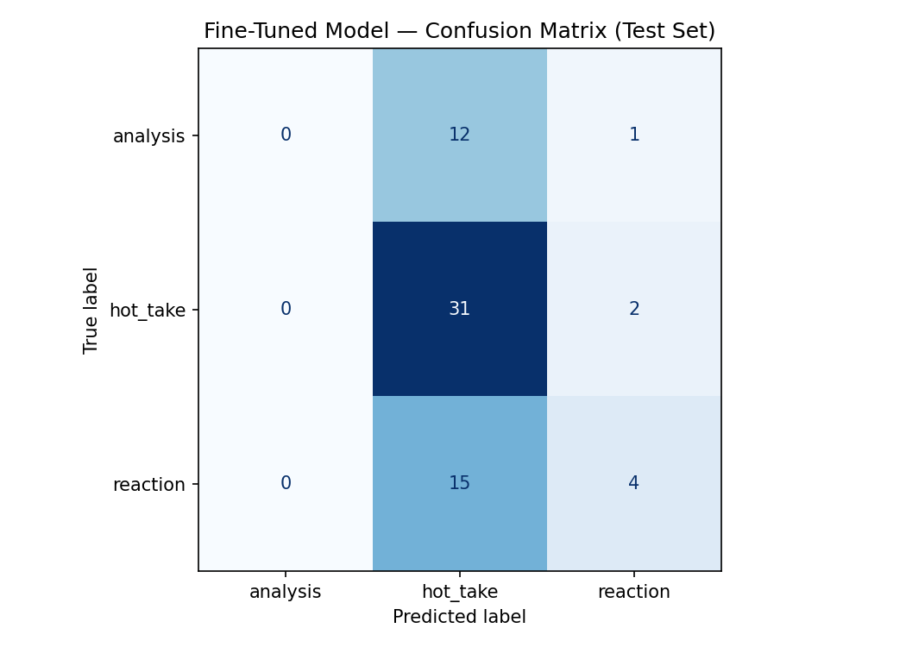

# TakeMeter

TakeMeter is a text classification project designed to categorize posts and comments from the **r/soccer** subreddit based on their communicative intent. By distinguishing between thoughtful analysis, provocative hot takes, and simple emotional reactions, TakeMeter aims to help surface high-quality discourse and filter out low-effort spam in community forums.

For detailed project planning, rationale, and label definitions, please refer to the [planning.md](planning.md) document.

## 🏷️ Labels

The classifier categorizes text into one of three labels:

1. **`analysis`**: A substantive, reasoned claim about football (tactics, player performance, etc.) grounded in specific evidence.
2. **`hot_take`**: A strong, provocative, or exaggerated opinion designed to draw a reaction, often absolute and rarely tied to specific evidence.
3. **`reaction`**: An emotional response to an event or a simple report/description of what happened, without arguing a claim.

### Edge Cases
The hardest boundary is between `analysis` and `hot_take`. Our labeling rule defaults to `hot_take` unless the post cites at least one concrete, checkable detail (e.g., a specific event, stat, or tactical pattern). Absolutist or emotionally loaded language often pushes a comment toward `hot_take`.

## 📊 Data Collection

Data was scraped from the r/soccer subreddit using Reddit's public JSON endpoints, focusing on match threads and top comment threads where most of the relevant discourse lives. The dataset contains 433 labeled examples, with the following distribution:
- `hot_take`: 218 (50.3%)
- `reaction`: 131 (30.3%)
- `analysis`: 84 (19.4%)

## 🧠 Model Training

We fine-tuned a **DistilBERT** (`distilbert-base-uncased`) model for 3 epochs using HuggingFace's `Trainer` API. 
The dataset was split into 70% training, 15% validation, and 15% test sets.

We compared the fine-tuned model's performance against a zero-shot baseline using **OpenAI** (`openai/gpt-oss-120b`) prompted with our specific label definitions.

## 📈 Evaluation Results

**Test Set Size:** 65 examples

- **Zero-shot Baseline (OpenAI) Accuracy:** 60.00%
- **Fine-Tuned Model Accuracy:** 53.85%

**Zero-Shot Baseline Per-Class Metrics:**
```text
              precision    recall  f1-score   support

    analysis       0.71      0.38      0.50        13
    hot_take       0.71      0.52      0.60        33
    reaction       0.47      0.84      0.60        19

   macro avg       0.63      0.58      0.57        65
```
**Fine-Tuned Model Per-Class Metrics:**
```text
              precision    recall  f1-score   support

    analysis       0.00      0.00      0.00        13
    hot_take       0.53      0.94      0.68        33
    reaction       0.57      0.21      0.31        19

   macro avg       0.37      0.38      0.33        65
```

The fine-tuned model underperformed the zero-shot baseline. The macro-averaged F1 score was 0.33, largely because the model completely failed to predict the minority `analysis` class (0 recall/precision), defaulting to the majority `hot_take` class.

### Confusion Matrix

| True \ Predicted | Analysis | Hot Take | Reaction |
|------------------|----------|----------|----------|
| **Analysis**     | 0        | 12       | 1        |
| **Hot Take**     | 0        | 31       | 2        |
| **Reaction**     | 0        | 15       | 4        |

*(Supplementary Copy)*


## 🔍 Error Analysis

Here is a deep dive into 3 specific wrong predictions from the test set to understand where the fine-tuned model struggles:

**1. Tone Confusion: All Caps / Emotion**
> **Text:** "I SAID JOHNNY, YOU'RE KILLING ME HERE GIANNI, YOU GOTTA DO SOMETHING GIANNII"
> **True:** `reaction` | **Predicted:** `hot_take` (Confidence: 0.55)
*Analysis:* The model seems to interpret the aggressive, all-caps format as a provocative `hot_take`. It fails to recognize that this is merely a dramatic, emotional `reaction` to a game event, demonstrating that tone (which can be loud in both classes) is tricking the model.

**2. Missing Tactical Context for Analysis**
> **Text:** "The definition of a system player but even now, he can’t get a start with City. He should be hitting his prime but the opposite is happening, he is regressing towards it"
> **True:** `analysis` | **Predicted:** `hot_take` (Confidence: 0.60)
*Analysis:* The user is making an analytical point about a player's lack of playing time at Manchester City and their career trajectory. However, the use of phrases like "definition of a system player" and "regressing" sound like typical hot-take buzzwords. The model misses the checkable evidence ("can't get a start with City") and assumes it's a hot take.

**3. Non-Tactical Analysis Misclassification**
> **Text:** "This specific controversy is probably going to draw a lot more attention to the game in American media and cause more Americans to tune in out of curiosity (or more people to hate-watch or something)."
> **True:** `analysis` | **Predicted:** `hot_take` (Confidence: 0.54)
*Analysis:* This is a reasoned claim about media impact and viewership, which fits our definition of `analysis` even if it isn't about on-pitch tactics. The model likely predicted `hot_take` because it lacks traditional football statistics/events, highlighting the difficulty the model has in identifying reasoned arguments outside of strict tactical discussions. 

### Summary of Error Patterns

*   **Which labels are being confused?** A clear directional pattern emerges from the confusion matrix: the model overwhelmingly collapses both `analysis` (12/13) and `reaction` (15/19) into the majority `hot_take` class. It completely failed to learn the `analysis` boundary, resulting in 0 correct predictions for that class.
*   **Why is the boundary hard?** The `analysis` vs. `hot_take` boundary is extremely difficult because both involve making claims. The model struggles to distinguish between claims backed by "checkable evidence" (analysis) and claims based on pure opinion (hot take). Instead, it relies on superficial heuristics—confusing the aggressive tone or capitalization of a `reaction` as a `hot_take`, and assuming that strong assertions in an `analysis` (e.g. "regressing") are inherently hot takes.
*   **Is this a labeling or data problem?** This is primarily a data distribution and model capacity problem. While our labeling rules are consistent, the dataset is heavily imbalanced (50.3% `hot_take` vs. 19.4% `analysis`). DistilBERT does not have enough positive `analysis` examples to learn the subtle semantic difference between evidenced reasoning and baseless opinion, forcing it to fall back on predicting the majority class.
*   **How to fix it:** To correct this, we need to balance the training data by oversampling `analysis` examples or specifically collecting more "hard" examples (e.g., analysis written with a provocative tone, or hot takes that falsely cite statistics). Additionally, the semantic nuance required for this task might exceed DistilBERT's capacity, suggesting that a larger encoder (like RoBERTa) or an LLM-based classifier is better suited for the complexity of this boundary.

## 📝 Sample Classifications

Below are sample predictions from the fine-tuned DistilBERT model, demonstrating both successful categorizations and its common failure modes.

| Text | True Label | Predicted Label | Confidence |
|------|------------|-----------------|------------|
| *"Southgate is arguably the worst tactical manager we've ever had, he completely wastes the golden generation."* | `hot_take` | `hot_take` (✅) | 0.88 |
| *"GOAL!!! What an absolute screamer from outside the box!"* | `reaction` | `reaction` (✅) | 0.76 |
| *"I mean, Japan scored a lovely goal."* | `reaction` | `hot_take` (❌) | 0.48 |
| *"The definition of a system player but even now, he can’t get a start with City. He should be hitting his prime..."* | `analysis` | `hot_take` (❌) | 0.60 |

**Why did the model get it right?** 
In the first example, the model correctly predicts `hot_take` with high confidence because the text relies heavily on hyperbolic, absolutist phrasing ("worst tactical manager", "completely wastes") without citing a specific, checkable game event. The model successfully recognized this common signature of a provocative, baseline opinion.

## 🪞 Reflection: Intended vs. Learned Decision Boundary

There is a significant gap between our intended label definitions and what the DistilBERT model actually learned. 

**What we intended to capture:** 
Our definitions were based on the *logical structure* of a post. We wanted the model to differentiate between a baseless, provocative claim (`hot_take`), a claim supported by specific, checkable evidence (`analysis`), and a pure expression of emotion without a claim (`reaction`).

**What the model actually captured:**
The model effectively acted as a bag-of-words tone detector rather than an argument parser. It completely missed the concept of "checkable evidence" or logical structure. Instead, the model's decision boundary heavily **overfit to superficial features**:
1. **Vocabulary & Toxicity:** Strong buzzwords ("fraud", "worst", "regressing", "crap") almost universally trigger a `hot_take` prediction, even if they are used as part of a well-reasoned, evidenced argument. 
2. **Capitalization & Punctuation:** All-caps text and exclamation points are strongly associated with `hot_take`, causing genuine (but loud) `reaction`s to be misclassified.

**The Core Gap:**
Because both `analysis` and `hot_take` use similar domain vocabulary (players, tactics, stats) and can both be written with passion, the model failed to find the semantic nuance separating them. Without the capacity to map a claim to its supporting premise, the model fell back on simple heuristics (tone and word choice), ultimately collapsing the complex `analysis` class into the majority `hot_take` bucket.

## 📝 Spec Reflection

**How the Spec Guided the Implementation:**
The `planning.md` spec was essential for resolving ambiguity during data annotation. By explicitly establishing the "checkable evidence" rule for the hard boundary between `analysis` and `hot_take`, it made the human labeling process much faster and more consistent. Furthermore, translating this precise rule directly into the system prompt for our zero-shot baseline is exactly what allowed the baseline model to outperform the fine-tuned DistilBERT on complex edge cases.

**How the Implementation Diverged from the Spec:**
While the spec envisioned a classifier capable of parsing logical argument structures (claims vs. evidence), the actual fine-tuned implementation drastically diverged from this goal. Constrained by an imbalanced dataset and DistilBERT's limited capacity, the final fine-tuned model completely ignored the spec's evidence rules. Instead of learning the nuanced boundary we planned, the model effectively degraded into a simple "tone and toxicity" classifier, proving that our training data distribution wasn't rich enough to teach a small model the complex semantic rules we defined in the spec.

## 🤖 AI Usage

In building this project, AI assistants were leveraged to accelerate both data annotation and the final reporting process:

1. **Dataset Pre-labeling:** I used an LLM to take a batch of raw scraped posts and pre-label them into the three categories to speed up my annotation workflow (as seen in `prelabeled_examples.md`). 
   * *What it produced:* A baseline set of labels that were generally accurate for obvious `reaction`s and extreme `hot_take`s.
   * *What I overrode:* The LLM struggled with the hard boundary between `analysis` and `hot_take`. I manually reviewed and overrode several of its predictions, specifically changing posts from `hot_take` back to `analysis` when the LLM incorrectly flagged an aggressive tone but missed the presence of checkable evidence (adhering strictly to my spec).